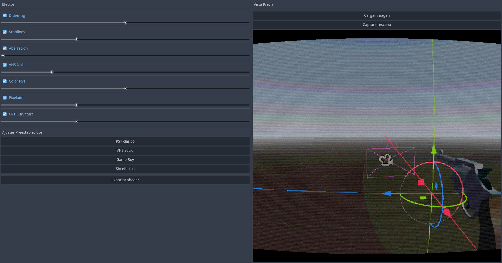

# Godot-PS1-Shader-Mixer

Visual post-process shader mixer plugin for Godot 4. Mix retro effects in real-time without touching code.

\# PS1 Shader Mixer — Godot 4 Plugin

A visual post-process shader mixer for Godot 4 with real-time preview. Mix and combine retro effects directly from the editor without touching any code.

\## Features

\- 7 customizable effects with sliders

\- Real-time preview with scene capture

\- Load any image as preview reference

\- Drag \& drop image support

\- Preset configurations (PS1, VHS, Game Boy)

\- Export ready-to-use `.gdshader` files

\- Adaptive resolution

\## Effects

\- \*\*Dithering\*\* — classic ordered dithering

\- \*\*Scanlines\*\* — CRT horizontal lines

\- \*\*Chromatic Aberration\*\* — RGB color fringing

\- \*\*VHS Noise\*\* — analog video noise

\- \*\*Color Quantization\*\* — PS1-style color reduction

\- \*\*Pixelate\*\* — resolution downscaling

\- \*\*CRT Curvature\*\* — screen warping effect

\## Installation

1\. Download or clone this repository

2\. Copy the `addons/ps1\_shader\_mixer` folder into your Godot project

3\. Go to \*\*Project → Project Settings → Plugins\*\*

4\. Enable \*\*PS1 Shader Mixer\*\*

5\. The panel will appear in the editor dock

\## Usage

1\. Open the \*\*PS1 Shader\*\* panel from the editor dock

2\. Adjust effects and sliders to your liking

3\. Use \*\*Capture scene\*\* to preview with your current scene

4\. Or drag \& drop any image onto the panel

5\. Apply a preset or mix effects manually

6\. Click \*\*Export shader\*\* to save your configuration

\## Using the exported shader

1\. Add a `ColorRect` node to your scene

2\. Set its layout to \*\*Full Rect\*\*

3\. Assign a new `ShaderMaterial` to it

4\. Load your exported `.gdshader` file

5\. Make sure the `ColorRect` is the \*\*last child\*\* in the scene tree so it renders on top of everything

\## License

MIT License — free to use in personal and commercial projects.
